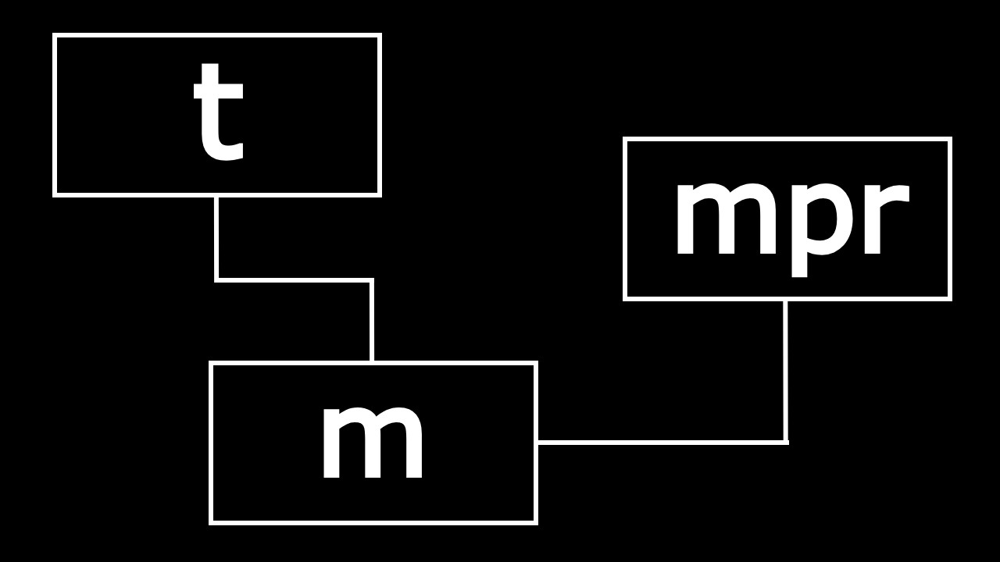
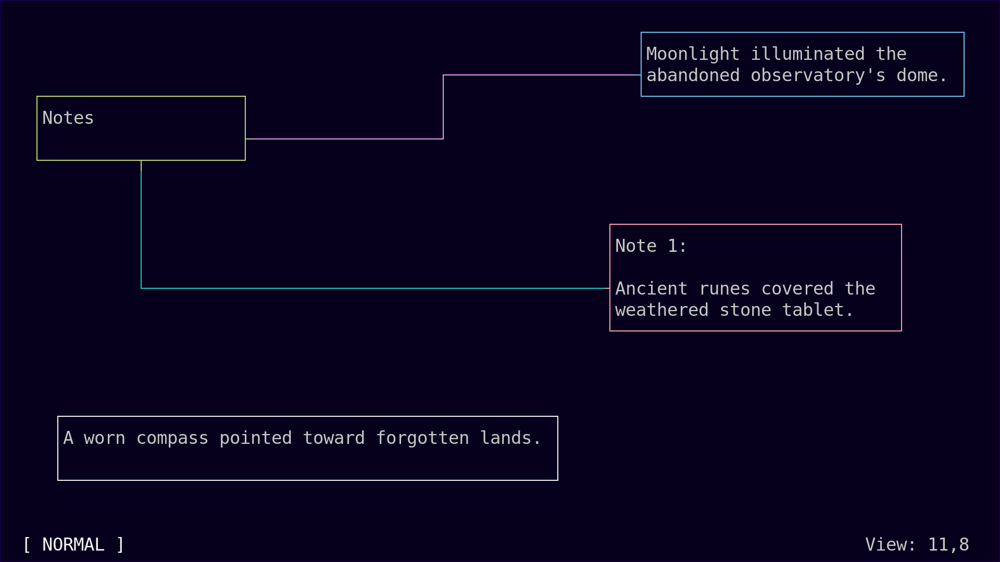
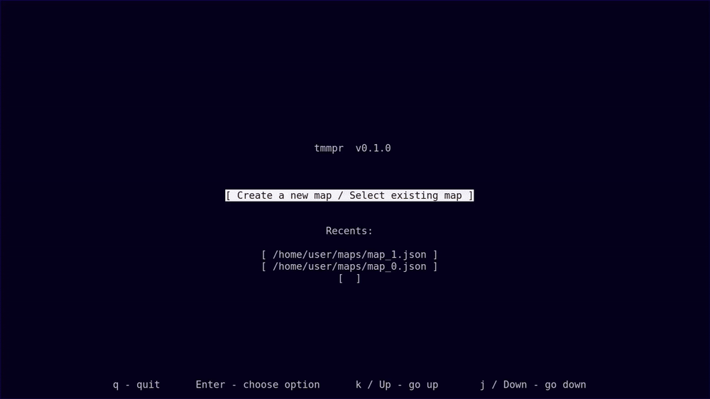

<div align="center">
  
</div>

<div align="center">

**t**erminal **m**ind **m**a**p**pe**r**

\* add button links

_tmmpr_ is a simple, lightweight mind mapping application that runs in your terminal,  
built with [Rust](https://www.rust-lang.org/) and [Ratatui](https://ratatui.rs)

</div>

## Overview

tmmpr is a Linux terminal application that lets you create, organize, and connect notes on an infinite canvas. Think of it as a digital whiteboard in your terminal where you can freely place notes anywhere and add connections between them.

The application is entirely keyboard-centered, offering efficient navigation and control through keyboard shortcuts and vim-inspired keybindings.

## Features

- **Infinite Canvas**: Place notes anywhere on a positive coordinate system (0,0 to infinity)
- **Visual Connections**: Draw and manage connections between notes with customizable colors and sides
- **Vim-Inspired Navigation**: Efficient keyboard-driven interface with hjkl movement
- **Multiple Modes**: 
  - Normal Mode - viewport navigation and general commands
  - Visual Mode - select and manage notes
  - Edit Mode - text editing with optional modal (vim-inspired) editing
  - Move Mode - reposition notes on the canvas
  - Connection Mode - manage note connections
- **Auto-Save**: Configurable auto-save intervals to prevent data loss
- **Backup System**: Automatic backups with customizable intervals (daily, weekly, etc.)
- **Customizable**: Adjustable settings for connections, auto-save intervals, and editing behavior

## Previews





## Installation

```shell
cargo install tmmpr
```

## Usage

Simply run the application from your terminal:

```shell
tmmpr
```

### Keybindings

> **📖 View In-App Help:** Press `?` or `F1` from the Map Screen to open the interactive help pages with all keybindings and detailed explanations.

#### Normal Mode

**General Commands:**
- `F1` / `?` - Toggle help screen
- `q` - Quit to start screen (if saved) or show confirm discard menu
- `s` - Save map file
- `o` - Open settings

**Viewport Navigation:**
- `h` / `Left Arrow` - Move viewport left by 1
- `H` / `Shift+Left Arrow` - Move viewport left by 5
- `j` / `Down Arrow` - Move viewport down by 1
- `J` / `Shift+Down Arrow` - Move viewport down by 5
- `k` / `Up Arrow` - Move viewport up by 1
- `K` / `Shift+Up Arrow` - Move viewport up by 5
- `l` / `Right Arrow` - Move viewport right by 1
- `L` / `Shift+Right Arrow` - Move viewport right by 5

**Note Operations:**
- `a` - Add a new note and switch to Edit Mode
- `v` - Select closest note to center of screen and switch to Visual Mode

#### Visual Mode

**General Commands:**
- `ESC` - Switch back to Normal Mode
- `i` - Switch to Edit Mode
- `m` - Switch to Move state
- `c` - Switch to Connection state (edit existing connections)
- `C` - Add a new connection from the selected note
- `d` - Delete the selected note (shows confirmation prompt)
- `e` - Cycle through note colors

**Note Focus Switching:**
- `h` / `Left Arrow` - Switch focus to note on the left
- `j` / `Down Arrow` - Switch focus to note below
- `k` / `Up Arrow` - Switch focus to note above
- `l` / `Right Arrow` - Switch focus to note on the right

#### Visual (Move) Mode

- `m` - Switch back to Visual Mode normal state
- `ESC` - Switch back to Normal Mode
- `h` / `Left Arrow` - Move note left by 1
- `H` / `Shift+Left Arrow` - Move note left by 5
- `j` / `Down Arrow` - Move note down by 1
- `J` / `Shift+Down Arrow` - Move note down by 5
- `k` / `Up Arrow` - Move note up by 1
- `K` / `Shift+Up Arrow` - Move note up by 5
- `l` / `Right Arrow` - Move note right by 1
- `L` / `Shift+Right Arrow` - Move note right by 5

#### Visual (Connection) Mode

**Connection Management:**
- `c` - Confirm connection placement and switch to Visual Mode
- `r` - Rotate connection start/end side
- `n` - Cycle through available connections on this note
- `d` - Delete selected connection
- `e` - Cycle through connection colors

**Target Note Selection:**
- `h` / `Left Arrow` - Switch focus to note on the left
- `j` / `Down Arrow` - Switch focus to note below
- `k` / `Up Arrow` - Switch focus to note above
- `l` / `Right Arrow` - Switch focus to note on the right

#### Edit Mode

**Normal Edit Mode (Default):**
- Any character, `Enter`, `Backspace`, Arrow keys for typing/editing
- `ESC` - Exit Edit Mode (returns to Normal Mode)

**Modal Edit Mode (when enabled in settings):**

*Edit Normal Mode:*
- Navigation: `h/j/k/l` (left/down/up/right)
- `g` - Go to beginning
- `G` - Go to end
- `w` - Next word
- `b` - Previous word
- `i` - Enter Insert Mode
- `a` - Move cursor after current character and enter Insert Mode
- `x` - Delete character
- `ESC` - Exit Edit Mode (returns to main Normal Mode)

*Edit Insert Mode:*
- Any character, `Enter`, `Backspace`, Arrow keys for typing/editing
- `ESC` - Switch to Edit Normal Mode

## Settings

Access settings by pressing `o` from the map screen. Configurable options include:

- **Map Changes Auto Save Interval** - Automatic save frequency (or disable)
- **Backups Interval** - How often to create backups when opening files
- **Runtime Backups Interval** - Create backups during long editing sessions
- **Default Connection Sides** - Default start/end sides for connections
- **Modal Edit Mode** - Enable vim-inspired modal editing

## Acknowledgements

Concept taken from: [Obsidian Canvas][ObsidianCanvas]

## License

This project is licensed under the [MIT License][MITLicense]

[ObsidianCanvas]: https://obsidian.md/canvas
[MITLicense]: https://github.com/hotellogical05/tmmpr/blob/main/LICENSE