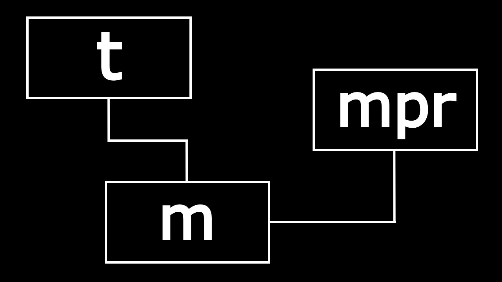
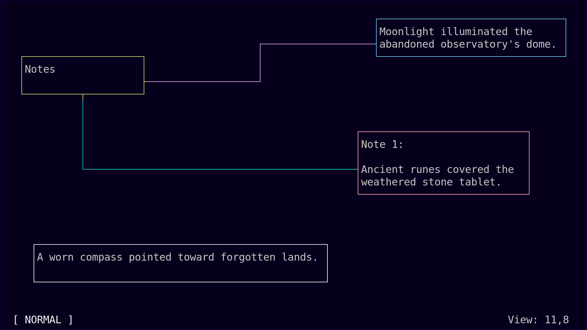
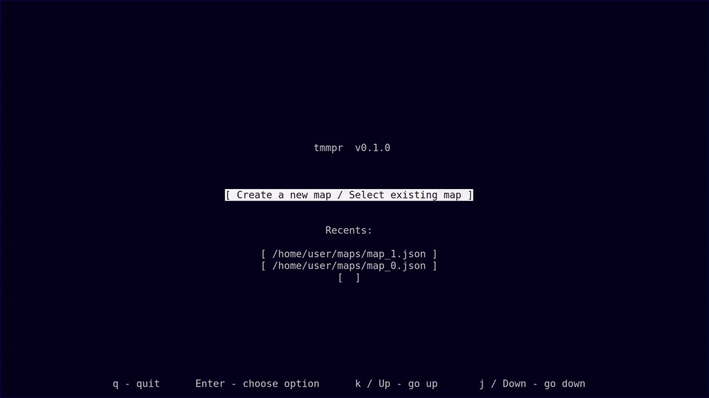

<div align="center">
  
</div>

<div align="center">

# tmmpr

**t**erminal **m**ind **m**a**p**pe**r**

_A simple, lightweight mind mapping application that runs in your terminal_

[](https://github.com/tanciaku/tmmpr)
[](https://crates.io/crates/tmmpr)

[](https://codecov.io/gh/tanciaku/tmmpr)

> ⚠️ **Development Pause** — I'll be taking a break from active development for personal reasons, likely for a couple of months. The project is functional in its current state — expect some rough edges, but it works well for its core purpose. I intend to resume development afterward and will address open issues and PRs at that time. Feedback and contributions are still welcome!

[Installation](#-installation) • [Usage](#-usage) • [Features](#-features) • [Keybindings](#-keybindings) • [Status & Roadmap](#-project-status--roadmap)

</div>

---

## 📖 Overview

**tmmpr** is a Linux terminal application that lets you create, organize, and connect notes on an infinite canvas. Think of it as a digital whiteboard in your terminal where you can freely place notes anywhere and draw connections between them.

The application is entirely keyboard-driven, offering efficient navigation and control through vim-inspired keybindings. Perfect for brainstorming, project planning, or organizing complex ideas.

**Current State:** The core functionality works well—you can create maps, add notes, draw connections, and save your work. However, this is an active work in progress with planned improvements to code quality and feature completeness. See [Project Status & Roadmap](#-project-status--roadmap) below.

## ✨ Features

- 🗺️ **Infinite Canvas** - Place notes anywhere on a positive coordinate system (0,0 to infinity)
- 🔗 **Visual Connections** - Draw and manage connections between notes with customizable colors and sides
- ⌨️ **Vim-Inspired Navigation** - Efficient keyboard-driven interface with hjkl movement
- 🎯 **Multiple Modes**:
  - Normal Mode - viewport navigation and general commands
  - Visual Mode - select and manage notes
  - Visual (Move) Mode - reposition notes on the canvas
  - Visual (Connection) Mode - manage note connections
  - Edit Mode - text editing with optional modal (vim-inspired) editing
- 💾 **Auto-Save** - Configurable auto-save intervals to prevent data loss
- 🔄 **Backup System** - Automatic backups with customizable intervals (daily, weekly, etc.)
- 🎨 **Customizable** - Color-coded notes and connections, adjustable settings

## 🧪 Testing

This project maintains **~54% test coverage**, focusing on business logic, state management, and input handling. The terminal UI layer (`/src/ui/`) is validated through manual testing and real-world usage rather than automated tests, as UI testing in terminal applications often provides limited value relative to the maintenance cost.

You can find extensive test suites throughout the codebase:
- State management tests: `/src/states/*/tests/`
- Input handling tests: `/src/input/map/tests/`
- Utility function tests: `/src/utils/tests/`

## 📸 Previews





## 🚀 Installation

### Pre-built Binary (Quick Start)

Download the latest release from the [Releases page](https://github.com/tanciaku/tmmpr/releases):

```shell
# Download the latest release
wget https://github.com/tanciaku/tmmpr/releases/latest/download/tmmpr-linux-x86_64.tar.gz

# Extract and run
tar -xzf tmmpr-linux-x86_64.tar.gz
./tmmpr

# Optional: move to your PATH
sudo mv tmmpr /usr/local/bin/
```

### From Crates.io (Recommended)

```shell
cargo install tmmpr
```

### From the AUR (for Arch Linux)

```shell
paru -S tmmpr
```

### With Nix / NixOS

```shell
# Run without installing
nix run github:tanciaku/tmmpr

# Install to your profile
nix profile install github:tanciaku/tmmpr
```

### From Source

```shell
git clone https://github.com/tanciaku/tmmpr.git
cd tmmpr
cargo build --release
# Binary will be at ./target/release/tmmpr
```

### System Requirements

- **OS**: Linux (primary support)
- **Rust**: 1.85.0 or higher (requires Rust 2024 edition)
- **Terminal**: Any terminal emulator with Unicode support

## 💻 Usage

Simply run the application from your terminal:

```shell
tmmpr
```

You'll be greeted with a start screen where you can:
- Create a new mind map
- Open an existing map file
- Access recent files

## ⌨️ Keybindings

> **📖 View In-App Help:** Press `?` or `F1` from the Map Screen to open the interactive help pages with all keybindings and detailed explanations.

**💡 Zooming:** Since **tmmpr** runs in your terminal, zooming is controlled by adjusting your terminal emulator's font size. Most terminals use `Ctrl` + `+` / `Ctrl` + `-` (or `Cmd` + `+` / `Cmd` + `-` on macOS). The specific shortcuts vary by terminal emulator (GNOME Terminal, Konsole, iTerm2, Alacritty, etc.), so consult your terminal's documentation if needed.

---

<details>
<summary><b>📋 Click to expand full keybindings reference ⬇️</b></summary>

### Normal Mode

**General Commands:**
- `F1` / `?` - Toggle help screen
- `q` - Quit to start screen (if saved) or show confirm discard menu
- `s` - Save map file
- `o` - Open settings

**Viewport Navigation:**
- `h` / `Left Arrow` - Move viewport left by 1
- `H` / `Shift+Left Arrow` - Move viewport left by 5
- `j` / `Down Arrow` - Move viewport down by 1
- `J` / `Shift+Down Arrow` - Move viewport down by 5
- `k` / `Up Arrow` - Move viewport up by 1
- `K` / `Shift+Up Arrow` - Move viewport up by 5
- `l` / `Right Arrow` - Move viewport right by 1
- `L` / `Shift+Right Arrow` - Move viewport right by 5

**Note Operations:**
- `a` - Add a new note and switch to Edit Mode
- `v` - Select closest note to center of screen and switch to Visual Mode

### Visual Mode

**General Commands:**
- `ESC` - Switch back to Normal Mode
- `i` - Switch to Edit Mode
- `m` - Switch to Move state
- `c` - Switch to Connection state (edit existing connections)
- `C` - Add a new connection from the selected note
- `d` - Delete the selected note (shows confirmation prompt)
- `e` - Cycle through note colors

**Note Focus Switching:**
- `h` / `Left Arrow` - Switch focus to note on the left
- `j` / `Down Arrow` - Switch focus to note below
- `k` / `Up Arrow` - Switch focus to note above
- `l` / `Right Arrow` - Switch focus to note on the right

### Visual (Move) Mode

- `m` - Switch back to Visual Mode normal state
- `ESC` - Switch back to Normal Mode
- `h` / `Left Arrow` - Move note left by 1
- `H` / `Shift+Left Arrow` - Move note left by 5
- `j` / `Down Arrow` - Move note down by 1
- `J` / `Shift+Down Arrow` - Move note down by 5
- `k` / `Up Arrow` - Move note up by 1
- `K` / `Shift+Up Arrow` - Move note up by 5
- `l` / `Right Arrow` - Move note right by 1
- `L` / `Shift+Right Arrow` - Move note right by 5

### Visual (Connection) Mode

**Connection Management:**
- `c` - Confirm connection placement and switch to Visual Mode
- `r` - Rotate connection start/end side
- `n` - Cycle through available connections on this note
- `d` - Delete selected connection
- `e` - Cycle through connection colors

**Target Note Selection:**
- `h` / `Left Arrow` - Switch focus to note on the left
- `j` / `Down Arrow` - Switch focus to note below
- `k` / `Up Arrow` - Switch focus to note above
- `l` / `Right Arrow` - Switch focus to note on the right

### Edit Mode

**Normal Edit Mode (Default):**
- Any character, `Enter`, `Backspace`, Arrow keys for typing/editing
- `ESC` - Exit Edit Mode (returns to Normal Mode)

**Modal Edit Mode (when enabled in settings):**

*Edit Normal Mode:*
- Navigation: `h/j/k/l` (left/down/up/right)
- `g` - Go to beginning
- `G` - Go to end
- `w` - Next word
- `b` - Previous word
- `i` - Enter Insert Mode
- `a` - Move cursor after current character and enter Insert Mode
- `x` - Delete character
- `ESC` - Exit Edit Mode (returns to main Normal Mode)

*Edit Insert Mode:*
- Any character, `Enter`, `Backspace`, Arrow keys for typing/editing
- `ESC` - Switch to Edit Normal Mode

</details>

## 📊 Project Status & Roadmap

### Current State

The application is fully functional for its core purpose - creating, organizing, and managing mind maps in the terminal. Most features work as intended.

> 🛑 **Development Pause** — I'll be taking a break from active development for personal reasons, likely for a couple of months. The project is functional in its current state. I intend to resume development afterward and will address open issues and PRs at that time.

### 🚧 Known Limitations

**Code Quality:**
- Code structure and approaches could use refactoring throughout the application

**Edit Mode (Vim-style):**
- Normal mode is very limited compared to vim
- No Visual mode within the text editor
- Block cursor placement issues in Normal mode

### 🗺️ Roadmap

**Upcoming Features:**
- Library API for node graph functionality (programmatic usage)
- Enhanced Edit Mode (fixing block cursor issue, expanded vim commands, visual selection, better text operations)
- Export functionality (convert maps to other formats like markdown)
- Import functionality (templates and config files for recurring structures)
- Image support

## ⚙️ Settings

Access settings by pressing `o` from the map screen. Configurable options include:

- **Map Changes Auto Save Interval** - Automatic save frequency (or disable)
- **Backups Interval** - How often to create backups when opening files
- **Runtime Backups Interval** - Create backups during long editing sessions
- **Default Connection Sides** - Default start/end sides for connections
- **Modal Edit Mode** - Enable vim-inspired modal editing (note: currently limited)

## 🛠️ Troubleshooting

**Issue: Terminal display looks wrong**
- Ensure your terminal supports Unicode characters
- Try resizing your terminal window

**Issue: Files not saving**
- Check file permissions in your working directory
- Verify disk space availability

**Issue: Keybindings not working**
- Check that your terminal is not intercepting key combinations
- Some terminals may not support all key combinations

## 🤝 Contributing

Contributions, feedback, and suggestions are **highly welcome!** This project is actively being improved, and your input can help shape its direction.

**Ways to contribute:**
- 🐛 **Report bugs** - Open an issue with details about what you encountered
- 💡 **Suggest features** - Share ideas for new functionality or improvements
- 🔧 **Submit pull requests** - Code improvements, bug fixes, or documentation updates
- 📝 **Improve documentation** - Help clarify usage, add examples, or improve comments
- 🧪 **Testing feedback** - Report issues with specific terminals, edge cases, or workflows

**Areas needing help:**
- Code refactoring and structural improvements

No contribution is too small—whether it's fixing a typo or tackling a major refactor!

## 📝 License

This project is licensed under the [MIT License][MITLicense]

## 🙏 Acknowledgements

Concept inspired by: [Obsidian Canvas][ObsidianCanvas]

Built with ❤️ using [Rust](https://www.rust-lang.org/) 🦀 and [Ratatui](https://ratatui.rs) 🐀

---

<div align="center">

**Enjoy mapping your thoughts! 🗺️**

</div>

[ObsidianCanvas]: https://obsidian.md/canvas
[MITLicense]: https://github.com/tanciaku/tmmpr/blob/main/LICENSE
